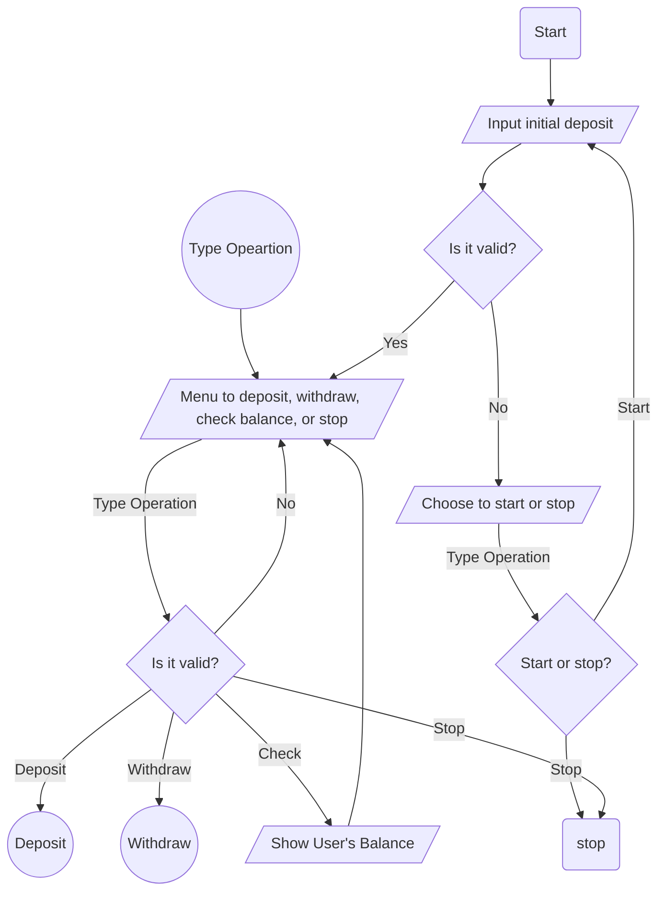
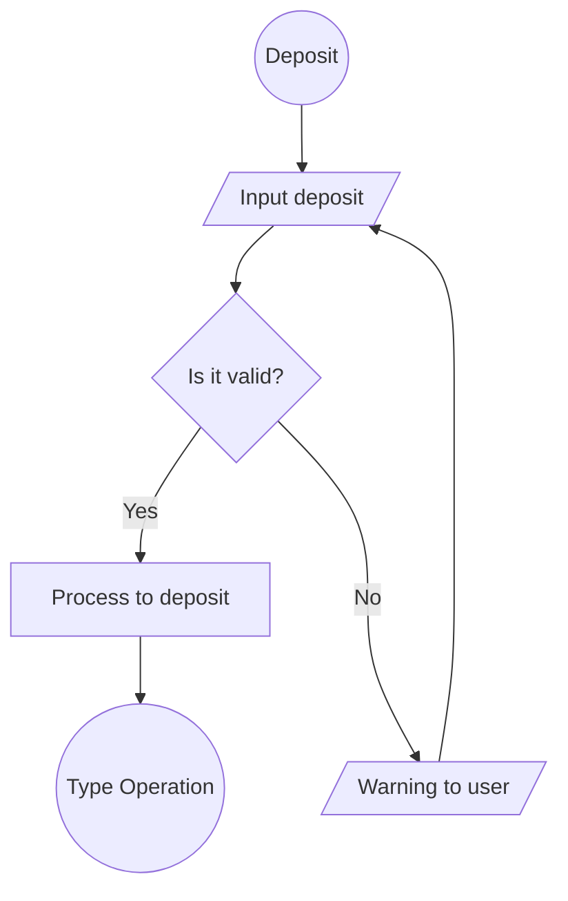
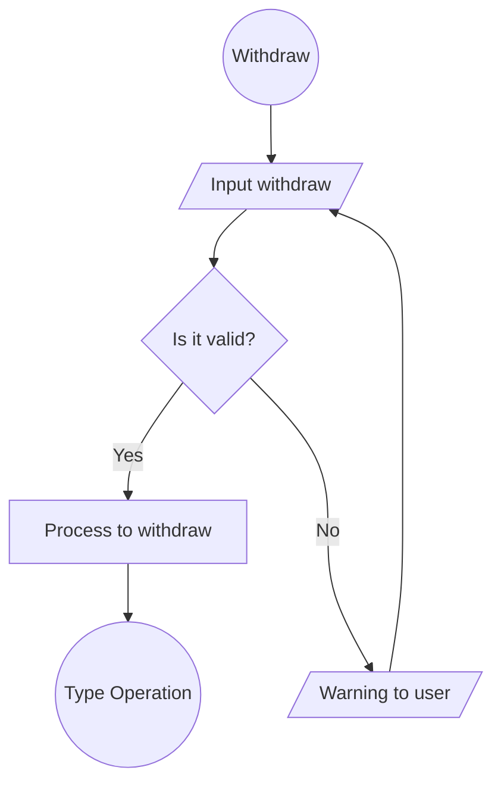

# Basic Banking System

List of contents

<ul>
    <li>[Deposit](#deposit)</li>
    <li>[Withdraw](#withdraw)</li>
</ul>

The BankingSystem class is a subclass of BankAccount that provides methods for depositing, withdrawing, and retrieving the balance of a bank account. It extends the functionality of the BankAccount class by adding error handling and user interaction. The deposit and withdraw methods prompt the user for input, validate the amount, and update the balance accordingly. The getBalance method retrieves the current balance of the account asynchronously after a delay of 1 second.

***
Overview of Basic System in Flowchart
***

## Deposit
 It prompts the user to enter an amount to deposit, validates the amount, and then deposits it into the account. If an error occurs during the deposit, it alerts the user with the error message and recursively calls the [deposit]

***
Flowchart of deposit process
***

## Withdraw
This code is like a function in a banking system that lets you take money out of your account.

It first asks you how much money you want to take out. Then it checks if you have enough money in your account to take out that amount. If you don't have enough, it will show you a message saying you can't take out that much.

If you have enough money, it will take the money out of your account and show you how much money you have left.

If something goes wrong during this process, like entering the wrong amount, it will show you an error message and let you try again to take out money.

It's like a digital ATM, but in a programming language!

***
Flowchart of withdraw's process
***
***Attention: 
For running this code u have to runs it to Web Server or Enables CORS Policy
***