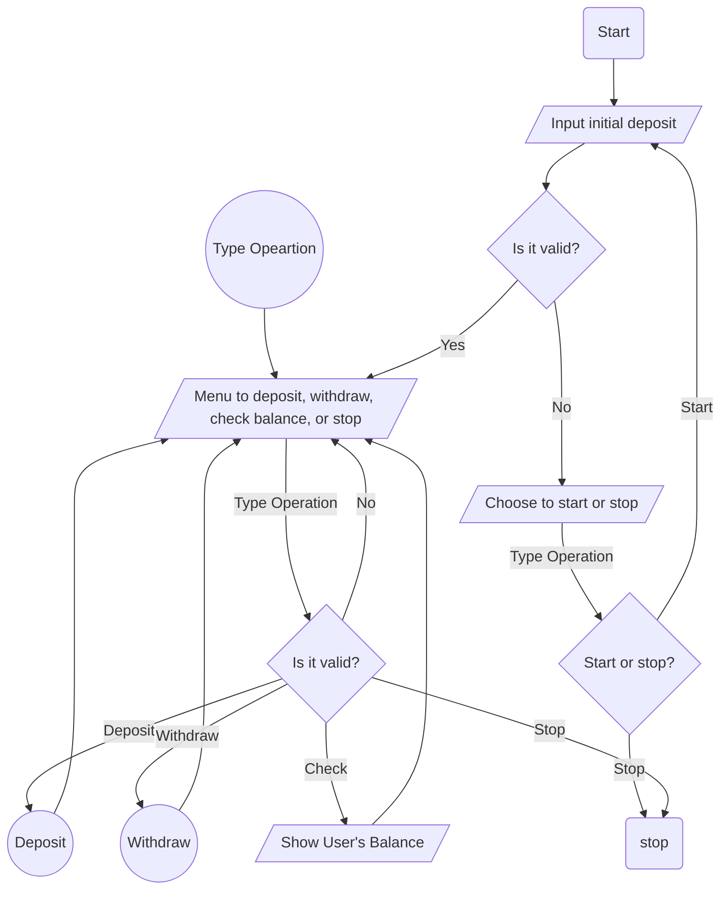
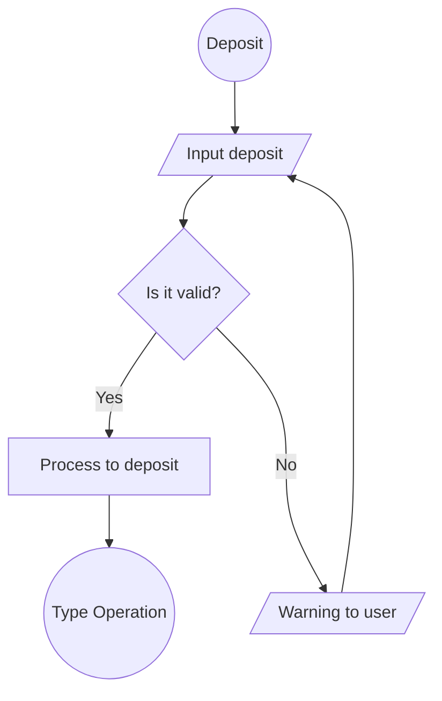

# Basic Banking System


## Deposit

## Withdraw
```mermaid
flowchart TD;
A((Withdraw))
A-->B[/Input withdraw/]
B-->C{Is it valid?}
C--Yes-->D[Process to withdraw]
D-->F((Type Operation))
C--Noo-->E[/Warning to user/]
E-->B